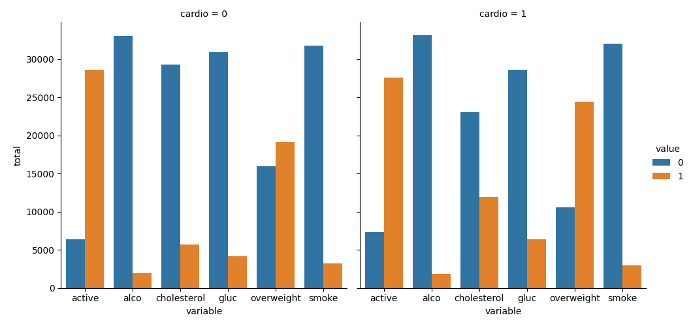
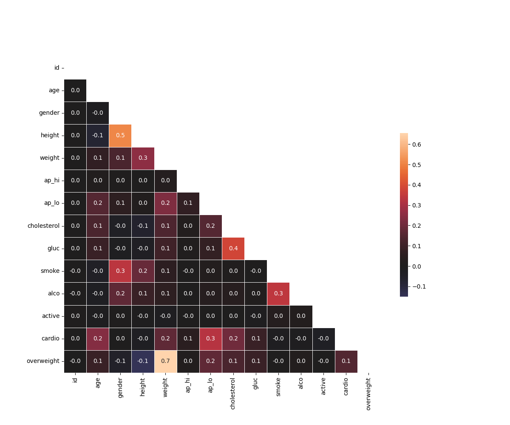

# Medical Data Visualizer

This project analyzes and visualizes medical examination data using Python, pandas, seaborn, and matplotlib.

## 📁 Dataset

The dataset includes patient information like age, height, weight, blood pressure, cholesterol, glucose, and lifestyle habits. The goal is to understand how these features relate to cardiovascular disease.

## 📊 Visualizations

### 1. Categorical Plot

This bar plot compares lifestyle and health factors (cholesterol, glucose, smoking, alcohol intake, activity, and overweight status) between patients with and without cardiovascular disease.



### 2. Heat Map

This heatmap shows the correlation matrix of the cleaned data. It highlights which features are strongly or weakly correlated.



## 🛠️ Technologies Used

- Python
- pandas
- seaborn
- matplotlib

## ▶️ How to Run

```bash
python main.py
---
*Created as part of a data visualization project from freeCodeCamp.*